# MotionKit · JS 动效模板引擎 + 剪辑插件

一套跑在浏览器里的**动效模板引擎**，专门做视频里那种"科技感叠加层"：
HUD 细线框、卡点大字、终端面板、编号卡片、跑马灯、计数器、故障 / 扫描 / 网点转场……
全部是纯 JS + Canvas 绘制的，**零依赖、零安装、离线可用**。

它给你的剪辑流程补上四件事：

| 你想要 | MotionKit 怎么做 |
| --- | --- |
| **卡点** | 拖进一首歌 → 自动算出 BPM 和每一个拍点 → 图层自动吸附，还能"一键每拍铺一层闪白" |
| **出字幕** | 导入 SRT / ASS / VTT → 自动切短句 → 卡点字幕模板逐句弹出 / 逐词高亮 |
| **做转场** | 甩镜、冲击推近、镜头震动、闪白、百叶窗、网点升起、扫描带、故障爆闪、遮幅推入、色散 |
| **视觉特效** | 颗粒、扫描线、色差、故障切片、暗角、辉光、像素化、VHS、数据摩什、反相闪光 |
| **剪素材** | 时间轴上一条条片段：视频 / 图片 / 音频都能挪、裁、切、复制、删，导出的 MP4 就是你剪出来的样子 |
| **调画面** | 每段都能变速、调色、缩放摆位（多轨叠加做画中画）；转场、交叉淡入淡出 |

做好的东西可以导出成**带 Alpha 的 PNG 序列 / WebM / MP4（直接出片）/ ProRes 4444**，
直接拖进 Premiere、剪映专业版、达芬奇、AE 当叠加层用；也可以让 ffmpeg 直接烧到你的成片上。

### ✨ 现在还有 AI 助手

丢一段视频进去，它自己挑片段、自己分析、自己出字幕、自己排图层，
你只在几个关键点上拍板：**配色风格、动效幅度、信息密度、要不要字幕、做多长**。

```bash
python agent/autopilot.py --video 素材.mp4 --out projects/demo --render
```

界面上在顶栏 **✨ AI 助手**（双击 `启动工作室.bat` 就是带后端的开发模式）。
细节看 [agent/README.md](agent/README.md)。

### ⚡ 一键铺满（先铺后改）

不想一上来就全自动？AI 助手面板里第一个按钮就是 **一键铺满**：
它先花几秒粗看一遍素材（亮度 / 运动量 / 镜头切点 / 卡点），
然后**按素材时长把整条时间轴铺满**——

- 全程一条 HUD 底噪（保证不留空）
- 每个镜头按内容配一个图层：暗且静→参数刻度、暗且动→数字计数、亮且动→圆盘仪表、
  长镜头→终端面板、亮且静→吊牌/编号卡
- 卡点补大字与闪白（强度越高越密），片头片尾各一记标题

铺完**自动载进工作室**，你在这基础上删多余的、改文字、拖位置。
和「开始生成」的区别：它不转写语音、不叫大模型，**几秒出结果**，目标是"先铺满、人来精修"。

```bash
python agent/fill.py --video 素材.mp4 --out projects/fill-1 --json-progress
```

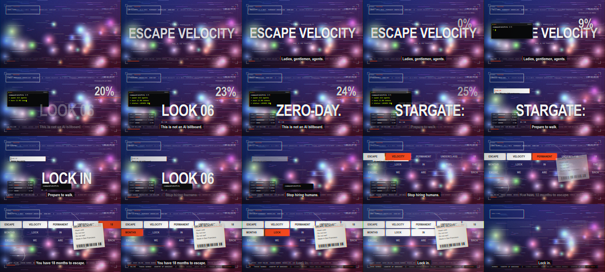

> 上面这一屏就是用 `presets/slopcore.json` 渲染出来的（叠加层铺在底图上）。
> 视觉语言参考了 [SLOPCORE: ESCAPE VELOCITY](https://www.youtube.com/watch?v=C3fxudvU-UU) 那支片子。

想要长的？同一套视觉有 **3 分钟版**：`presets/slopcore-3min.json`
（180 秒 / 40 图层 / 18 个模板，6 个段落各配一记转场和卡点大字，卡点闪白走特效栈）。

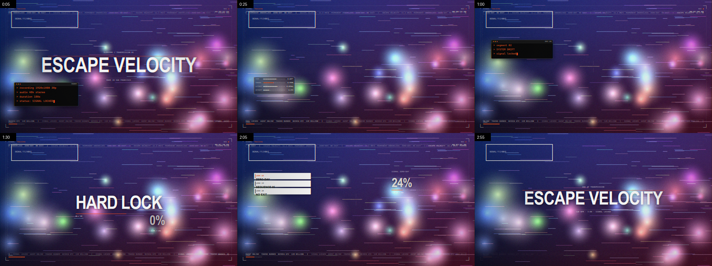

> 0:05 开头 → 0:25 信息层 → 1:00 终端 → 1:30 / 2:05 段落大字 → 2:55 收尾。

时长随便改，脚本会重新排版（分层错开、检查空档）：

```bash
python tools/make-long-preset.py --duration 300 --out presets/slopcore-5min.json
python tools/make-long-preset.py --duration 180 --bpm 96 --title "LOW EARTH ORBIT" --out presets/slopcore-3min.json
```

---

## 30 秒上手

> **字太小看不清？** 右栏「工程」页最上面有 **界面大小：小 / 标准 / 大 / 特大**，
> 选一下就整体放大 —— 字号、图标、时间轴行高一起变，设置记在浏览器本地。
> 默认这一版已经把字号上调过一档：按钮和面板正文 13px 起，工具栏图标 19px，
> 暗色说明文字也调亮了（以前是 10~11px 的灰字，确实费眼）。

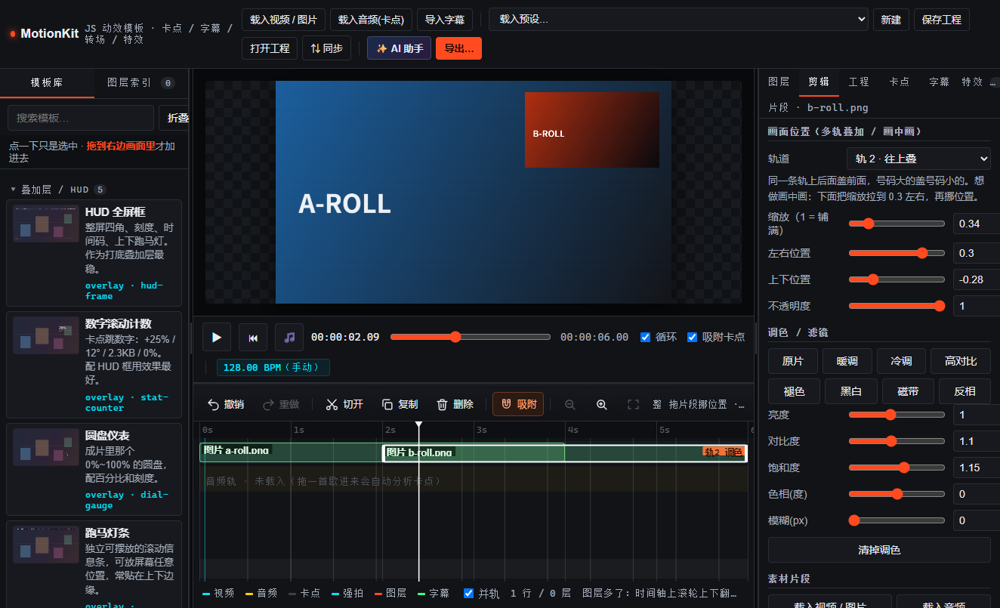

### 方式一：双击 `启动工作室.bat`（推荐）

它会起本地服务（开发模式）并**自动用 Chrome / Edge 打开工作室**，关掉就按窗口里的 Ctrl+C。
**AI 助手只有这个模式才有**，所以推荐一直用它。

顺手做的两件事：检查 Node / Python / faster-whisper 并在启动时告诉你缺什么；
重复双击不会起第二个服务——它会认出已经在跑的那个，直接把页面打开。

### 方式二：离线单文件版（没有 AI 助手）

直接双击 `dist/studio.html`。模板、卡点、字幕、导出全都在，只是没有 AI 助手。
**必须用 Chrome 或 Edge**：默认浏览器是 360 / QQ / 搜狗之类的话大概率白屏，
右键 `dist/studio.html` → 打开方式 → Google Chrome。

好处是零依赖、不占端口、可以拷到任何机器上跑。

### 方式三：命令行 / 改源码（改完即时生效）

```bash
npm run studio              # 起服务，手动打开 http://localhost:5178/studio/index.html
node tools/serve.mjs --open # 起服务并自动开浏览器（bat 里用的就是这个）
```

> 为什么开发模式需要服务器：源码是 ES Module，浏览器不允许 `file://` 直接加载模块；
> AI 助手还要调 python / ffmpeg / 无头浏览器，得有个后端转手。
> 改完源码跑 `npm run bundle` 重新生成 `dist/studio.html`。

### 然后

1. 把**视频**拖进中间的画面区（或者什么都不放，纯做叠加层）
2. 把**音乐**拖进去 → 自动分析出 BPM 和拍点，时间轴出现一条条卡点线
3. 左边模板库**按住一个模板拖到画面里**放下 → 图层加进来了（拖到哪儿就摆在哪儿的
   位置参数上），再在右边调参数
4. 加字幕：`导入字幕` 选 `.srt`，会自动挂一个"卡点字幕"图层
5. 右上角 `导出…`

> **工程会自动保存。** 改了什么都会存在浏览器本地，图层、参数、特效、字幕、卡点、
> 你在预览里摆的位置全都在。刷新页面、关掉浏览器、第二天再打开，都会自动接着上次继续。
> 要用别的机器 / 发给别人 / 手动留底，才需要点顶栏的 **保存工程** 存成 JSON。
> 想从空白开始：顶栏 **新建**，或者恢复提示条上的 **丢弃**。

> **两台电脑轮着开发？** 顶栏还有 **⇅ 同步**：点按钮就完成 提交 / 上传到 GitHub /
> 拉取更新，也能一键打包成 zip 免网络拷到另一台机器（同一个面板里还能复制 SSH 公钥）。
> 按钮都在 [docs/命令速查.md](docs/命令速查.md) 里写了，全程不用敲命令。

---

## 界面

**左右两栏都能拉宽**：把鼠标放到左栏右边 / 右栏左边那条细分隔上（会亮成橙色），
按住往两边拖就行——模板库想看全一点、参数面板嫌挤，都随你调；**双击分隔条复位**到默认宽度。
宽度会记住，中间的预览和时间轴自动跟着重新排版。

```
┌──────────────────────────────────────────────────────────────────────┐
│ 载入视频/图片 · 载入音频(卡点) · 导入字幕 · 预设 · 保存/打开工程 · 导出 │
├────────┬──────────────────────────────────────────────┬──────────────┤
│        │                                              │              │
│ 模板库 │            预览（棋盘格 = 透明）              │ 标签页：     │
│  ⇄     │                                              │ 图层 · 工程  │
│ 图层索引│                                             │ 卡点 · 字幕  │
│        ├──────────────────────────────────────────────┤ 特效        │
│        │  ▶ ⏮ 时间码 ──●────────── 循环 吸附卡点       │ 内容按页签   │
│        ├──────────────────────────────────────────────┤ 切换        │
│        │ 时间轴：卡点线 / 图层条 / 字幕轨 / 播放头      │              │
└────────┴──────────────────────────────────────────────┴──────────────┘
```

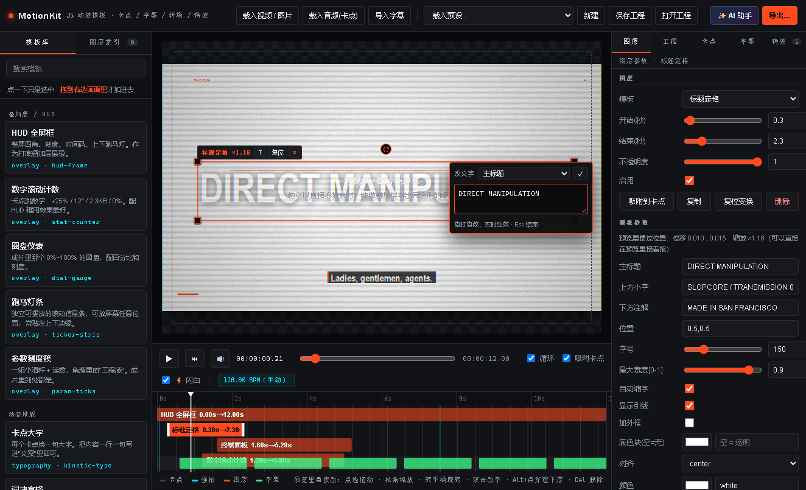

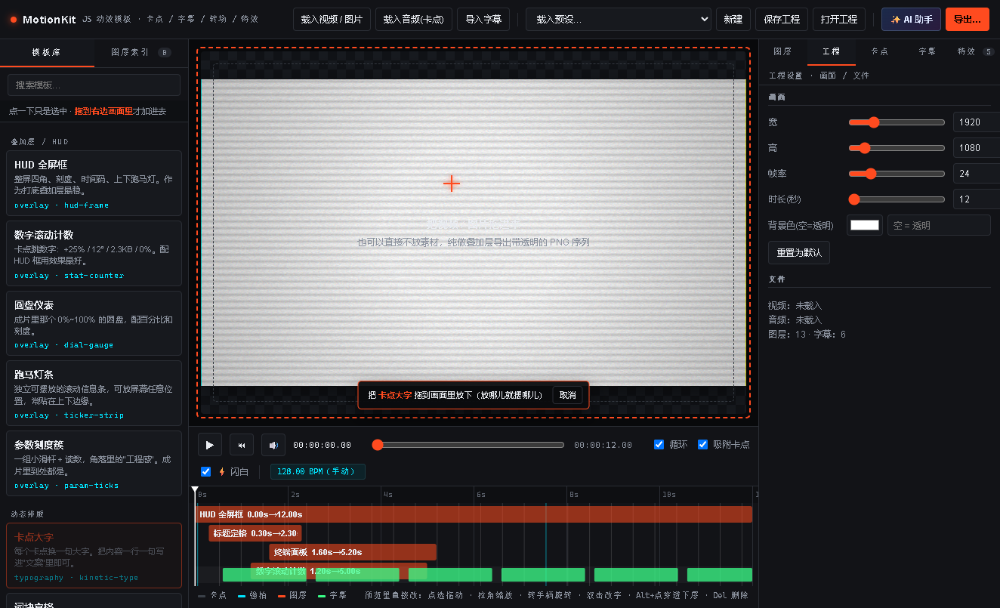

**右栏是分页签的**：`图层 / 工程 / 卡点 / 字幕 / 特效` 置顶，点一下就切，不用在一条长滚动条里翻。

**底色类参数带「透明」开关**：凡是底色性质的参数（垫底色、底色、填充、纸色、工程背景色…），
右边都有个 **透明** 勾选框 —— 勾上就是不要底色，色块会变成透明格子，再点掉会恢复上一个颜色。
（以前得把颜色文字框清空才算透明，没人猜得到。）
选中图层（在预览里点、在时间轴上点、在图层索引里点都算）会**自动跳到「图层」页**，
页签下面那行小字会告诉你在看哪一层。`特效` 页签上带一个数字，是当前挂了几条后期特效。

**模板库**（左栏第一个页签）：**点一下只是选中，不会往工程里塞东西**。要加图层，
得把模板**按住拖到中间的预览里松手**——画面会亮出虚线框和十字，标出落点；
拖到哪儿就摆在哪儿（落点会写进模板自己的 `位置` 参数）。全屏 HUD、转场这类
本来就没有位置参数的模板，按它们自己的默认布局来。

模板多到 39 个之后，这一栏还做了两件事方便找：

- **每个模板都有缩略图**：是拿引擎**真渲一遍**（默认参数、入场结束那一刻）再缩小的，
  不是截图也不是示意图，所以"看到的什么样、拖进去就什么样"。转场类模板底下会垫一张
  合成画面（它们是把当前帧抓下来变形，底下空的话什么都画不出来）
- **分类可以折叠**：点分类标题收起/展开，标题右边写着这一组有几个；搜索框旁边的
  **折叠 / 展开** 按钮一次收起或打开全部。搜索时被折叠的分类会自动展开，不会把结果藏起来。
  折叠状态会记住。

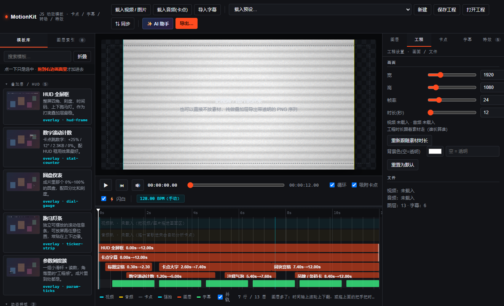

**直接在预览里改**：不用去右边翻参数。在预览上点一下图层就选中（选择框和手柄出来），
拖动挪位置、拉四个角缩放、转上面那个圆手柄旋转、**双击直接改文字**（浮窗里边打边看）。
位置 / 缩放 / 旋转记在图层自己的变换上，不去动模板的 `position` 参数，
所以 46 个模板——包括根本没有位置参数的全屏 HUD、字幕层、转场层——都能这么调；
而且导出和无头渲染走的是同一个引擎，界面里摆成什么样，导出来就是什么样。

**图层索引**（左栏第二个页签，快捷键 `I`）：图层一多，光看时间轴上的色条不知道谁是谁。
这里每行是一个图层，除了名字、模板、起止时间，还有一张**缩略图，画出这层在画面上的实际位置**
（不是读模板的 position 参数猜的，是把那一层单独渲染一次、量出来的真实包围盒）。
顶上一张小图画的是播放头这一刻画面里所有图层的框和编号，跟下面列表一一对应；
正在生效的行会高亮。

点一下行 = 选中并跳到该图层中间；双击 = 跳到开头；点行首的圆点 = 临时关掉这层（只看效果，不动参数）。
可以按时间或按层级排序，也可以搜名字。

**时间轴操作**：点图层条选中 · 拖两端改时长 · 拖中间整体移动 · 空白处点击移动播放头 ·
拖动时自动吸附卡点（可在走带栏关掉"吸附卡点"）。

**图层多了会不会看不全？不会，而且不浪费地方**：

- **自动并轨**（走带下面的「并轨」勾选框，默认开）：**时间上不重叠的图层共用一行**。
  一个动效一行太浪费——上面那套 13 层的预设并轨后只要 **7 行**，一行里能排下三个前后接力的图层。
  关掉它就回到"一层一行"，方便按栈序逐个对照。旁边会写着「7 行 / 13 层」，省了多少一目了然。
- **搜索联动**：在左边「图层索引」里打字，时间轴上匹配的图层**亮起青色描边**、其余淡下去，
  一下就能在密密麻麻的条里找到它。
- 图层区还能**滚轮上下翻**（右侧有滚动条），选中任意图层时间轴会自动滚到它可见；
  时间轴顶端那条**把手可以往上拖**调整高度（高度会记住）。

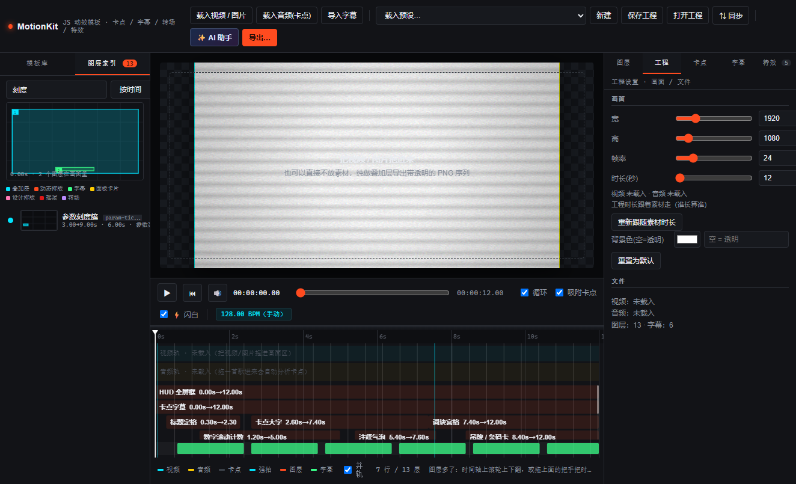

**时间轴上分了四条轨**：最上面 **视频轨**（载入的视频/图片，青色条；素材比工程短的话后面会灰掉，
一眼看得出哪段没画面）、下面是 **音频轨**（黄条 + 真实波形，卡点线直接压在波形上对照最直观），
再往下是**图层轨**，最底下是**字幕轨**。

**工程时长跟着素材自动走**：把视频/音乐拖进来，时长会自动取"素材里长的那个"，
不用手填。手动改过「时长」之后就切成手动（不会再来回跳），
工程设置里点 **重新跟随素材时长** 可以切回来。右边会同时显示素材各自的真实时长。

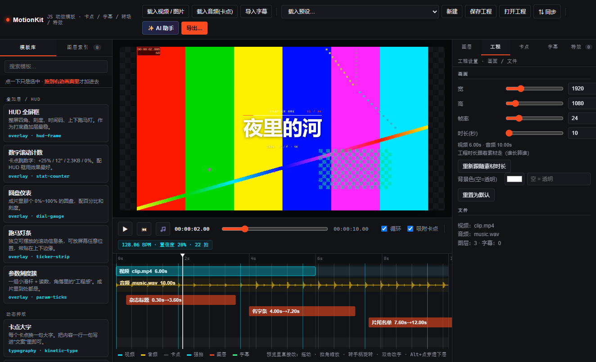

**预览操作**：点选拖动 · 拉角缩放 · 转手柄旋转 · 双击改文字 · `Alt`+点穿透到下层 ·
`Alt`+滚轮缩放 · 拖到画面中央会自动吸附（出现青色对中线）。

### 框选 + 一次删掉一批

不想要的图层不用一个个点着删：

- **预览里在空白处拖** = 框选，框到的图层一起选中（其余的一起变青色虚线框）
- **时间轴上 `Shift` + 在空白处拖** = 框选一块区域里的图层（不按 Shift 拖动还是原来的拖播放头）
- **`Shift` + 点**图层（预览或时间轴上都行）= 加选，`Ctrl/Cmd` + 点 = 在已选里来回切
- 选完按 **`Del`**，或者用右栏顶上那块「已选 N 层 → 删除这 N 层」，一次删干净

框选只认"此刻画面上真有的层"（所见即所选）；时间轴上是按时间和行框。选中的图层在预览里
是青色虚线框，在时间轴上整条压暗高亮，主选（参数面板认的那层）还是原来的橙色框加手柄。

**快捷键**：`空格` 播放/暂停 · `←/→` 逐帧（加 `Shift` 逐秒）· `Ctrl+Z` 撤销 / `Ctrl+Shift+Z` 重做 ·
`S` 在播放头切开片段 · `Ctrl+D` 复制片段 · `Del` 删掉选中的片段（没选片段时删图层）·
`Home/End` 跳头尾 · `I` 图层索引 · `M` 静音 · `Esc` 取消选中 ·
`Alt`+`←↑↓→` 微调选中图层的位置（加 `Shift` 走大步）。

---

## 卡点

### 卡点重复动效：整组改，不用一层层删

「一键铺满闪白」一铺就是十几个甚至几十个图层，之后想调就只能一个个删？不用了。
右边 **卡点** 页签下面有 **卡点重复动效（整组改）**：

| 控件 | 作用 |
| --- | --- |
| 强度 | 拖一下，**全部**闪白的峰值立刻跟着变 |
| 渐入 | 整组改淡入速度（闪白是"啪"地一下还是柔和一点） |
| 单次时长 | 全部一起变长/变短（贴到工程末尾的会自动截断） |
| **随机差异** | 0 是整齐划一，拉大之后每一记闪白的强度和时长都略有不同，**去机械重复感** |
| 频率 | 每拍 / 每 2 拍 / 每 4 拍 —— 换一档就**按新频率重铺**，不用手动加删 |
| 按当前设置重铺 | 用现在的强度/时长重新铺一遍（改过 BPM 之后尤其有用） |
| 全部关掉 / 全部打开 / 清空 | 一眼看出"关掉闪白"和"彻底不要"的区别 |

一共四组，面板上直接写着各有几个：**闪白硬切**、**冲击推近**（多了旋转和拖影两个整组参数）、
**卡点大字**、**卡点字幕**。

文字类是另一种处理：它不会清空重铺（那样文字就没了），而是**保留各自的内容、只按新频率重排时间**
（`按频率重排`），多出来的自动关掉而不是删掉。字幕组只给字号，因为字幕轨通常就一层。

这些批量铺出来的图层带 `group: "beat"` 标记，跟着工程一起存，换台电脑打开也认得出。

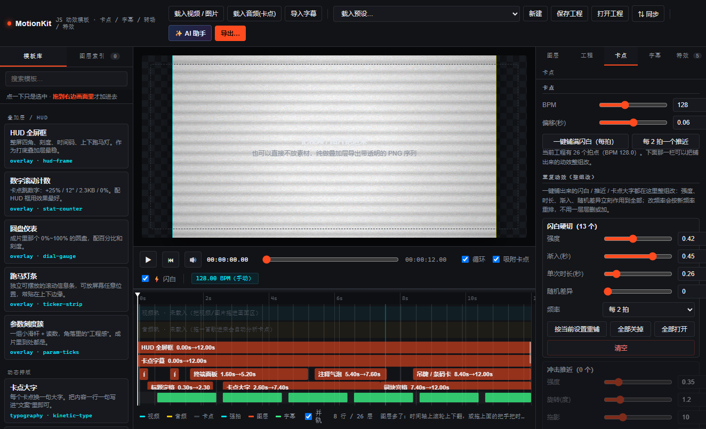

这是整套东西的核心。

拖入音频后，浏览器里会做一次真正的节拍分析：

1. STFT 求**分频段谱通量**，低频（底鼓）权重最高，高频（镲片）压下去
2. 对数压缩，避免低频瞬态把一切淹没
3. 自相关估周期，带 100–140 BPM 先验，避免半拍 / 双拍歧义
4. **最小二乘把拍点网格拟合到实际起音峰**——这一步是精度关键，
   能把 hop 带来的量化误差平掉。实测 128 BPM 的素材算出 128.01
5. 按 4/4 找强拍（第一个"1"）

得到的拍点会以竖线画在时间轴上（青色更粗 = 强拍），同时：

- 新加的图层自动吸附到最近的卡点
- 右边"卡点"分组可以改 BPM / 偏移
- **一键卡点铺满（闪白）**：每个拍点叠一个短闪白图层
- **每 2 拍铺一个推近**：两拍一个冲击推近

> 没有音频也行：默认 120 BPM，手动改 BPM 和偏移照样能卡。

命令行侧有一份等价实现：

```bash
python tools/beatmap.py --in music.mp3 --out beats.json --markers beats.txt --fps 25
```

`beats.txt` 可在 Premiere 的**标记面板 → 导入标记**，时间轴上就出现一条条卡点。

---

## 字幕

支持 **SRT / WebVTT / ASS(SSA)**。导入后：

- 自动挂一个 `卡点字幕` 图层（如果还没有的话）
- `把当前字幕切短句` 会按标点切成 ≤12 字的短块，并**按字符数分配时长**，用来做"逐句弹字"
- 有音频分析结果时，会给每条字幕估算**词级时间**，`karaoke` 样式即可逐词高亮

| 样式 | 效果 |
| --- | --- |
| `bar` | 黑条 + 白字，最像纪录片字幕（默认） |
| `mono` | 等宽小字，终端感 |
| `hero` | 超大居中 + 橙色短线，适合喊口号 |
| `karaoke` | 逐词从暗到亮（需要词级时间） |

### 字幕换装：一句台词一个样子

一条 `卡点字幕` 从头铺到尾，整片都是同一个样子。字幕面板里的**字幕换装**把每句台词
交给一个已有的设计模板来演 —— 池子里现在有 **19 种样子**（黑条字幕 / 等宽 / 逐词高亮 /
注释气泡 / 跑马灯条 / 终端面板 / 编号卡片 / 胶带标签 / 卡点大字 / 标题定格 / 词块宫格 /
索引标注 / 名字条 / 吊牌 / 压扁大字 / 竖排大字 / 杂志标题 / 摇滚大标题 / 系列编号）。

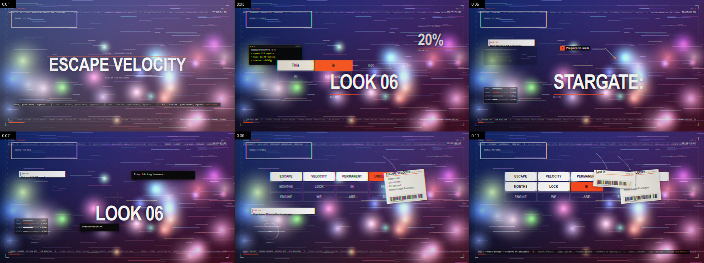

> 上面这排是 `presets/slopcore-captionstyles.json`：同一份 12 秒工程，
> 六句台词分别用跑马灯、词块宫格、索引标注、编号卡片、注释气泡、吊牌来演。

怎么用（工作室 → 右栏「字幕」页）：

1. **换装风格**：`字幕感`（贴着成片字幕的观感）/ `混合`（推荐）/ `海报感`（夸张，偶尔来一记）
2. **提前量**：图层比台词早起多少秒，默认 0.15
3. 点 **给每句字幕换模板** —— 不满意就 **换一批（重新洗牌）**，想回到一条字幕条就 **清掉换装**

它的取舍是明写在规则里的，不是随便挑一个：

- 用量少的先用：**一轮用完之前不会重复**，也不会出现某几个样子被反复用、另外几个从不露脸
- **连着两句不许撞样子**
- 每个样子自己声明"我这行最长放得下几个字"：长句子自动跳过胶带标签 / 名字条 / 吊牌 / 竖排，
  免得台词被截成半句或者冲出画面

AI 自动剪辑（`agent/director.py`）走的也是同一套样子池，所以「AI 助手 → 开始生成」
出来就已经是换装过的。想离线生成一份可以看可以改的：

```bash
python tools/caption-styles-demo.py --scene presets/slopcore.json \
       --out presets/slopcore-captionstyles.json --tier mid --seed 3
```

### 整组改：40 句 40 层，改一个等于改全部

换装出来的每句台词都是独立图层（40 句就是 40 层）。字幕面板最下面的
**字幕换装（整组改）**把它们当一个整体调，和「卡点重复动效」是一个路子：

| 控件 | 作用 |
| --- | --- |
| 字号 × | 整组放大缩小。给的是**倍数**，因为各模板原始字号差着好几倍（字幕条 44、卡点大字 118），统一设成 60 会把一半样子弄坏 |
| 上下 / 左右位置 | 走图层自带的变换，19 种样子通吃（会覆盖单独拖过的那点偏移，这是故意的） |
| 不透明度 | 整组压淡 / 恢复 |
| 提前量 / 尾巴 | 按字幕时间重排整组（字幕条类不给提前量，它自己按字幕起落） |
| 重置整组 | 字号 / 位置 / 不透明度回到刚换装时的基准 |
| 全部关掉 / 全部打开 / 删掉整组 | 预览对比、推倒重来 |

### 单独换一句 / 换模板不丢字

字幕页往下，每一句一行：左边是台词，右边下拉直接换**这一句**的样子，其它句不动。

在「图层」页用那个「模板」下拉换样式时，**台词会跟着搬过去** —— 这件事以前是丢的：
同一句话在不同模板里叫不同参数（字幕条的字在字幕轨上、卡点大字在 `text`、编号卡片在 `items`、
终端在 `lines`、吊牌在 `product`……），直接换 id 的话新模板读不到参数，画面上那句词就没了。
现在换之前先把文本抠出来，换完写进新模板对应的参数里，顺带把位置 / 颜色 / 强调色也带过去
（会把 `> ` 这类装饰和跑马灯的序号前缀清掉）。

字号**不**跟着走：各模板的字号不是一个量纲（字幕条 44、卡点大字 118），搬过去只会把版式弄坏 ——
和「整组改」用倍数是一个道理。

---

## 素材剪辑时间线（视频 / 图片 / 音频）

时间轴上现在是**一条条片段**，不再是"一个视频 + 一支音乐"：

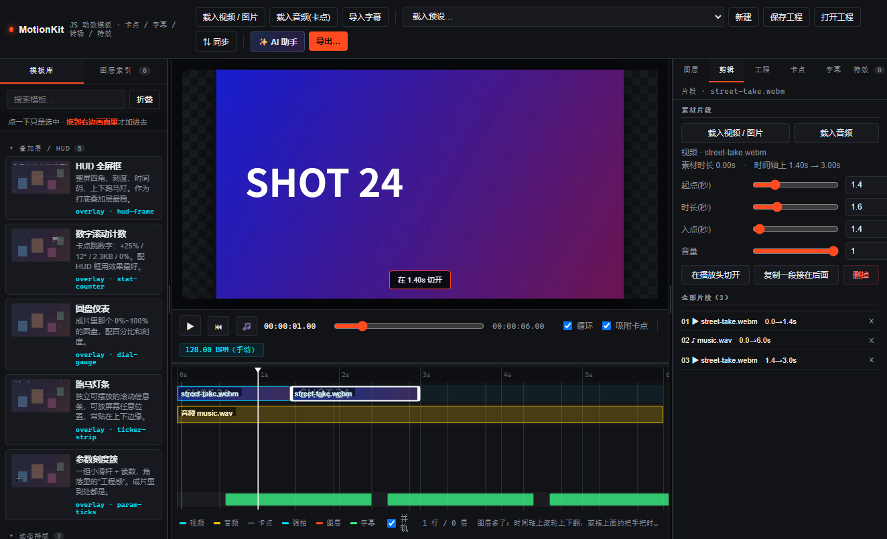

| 能做 | 怎么做 |
| --- | --- |
| 加素材 | 顶栏 `载入视频 / 图片` / `载入音频`，或者把文件直接拖进画面区 |
| 挪位置 | 拖片段本体（会吸附播放头、工程两头、别的片段边缘） |
| 裁剪 | 拖片段**左右两边的白条** —— 左边改入点和起点，右边只改长度，都不会超过素材本身 |
| 切开 | 播放头挪到要切的地方，按 **`S`**，或者右栏「剪辑 → 在播放头切开」 |
| 复制 | 「复制一段接在后面」——切开 + 复制拼出一段循环很方便 |
| 删除 | 选中片段按 `Del`（没选片段时 `Del` 删的是图层） |
| 精确改数值 | 右栏「剪辑」页：起点 / 时长 / 入点 / 音量 |
| 改工程时长 | 片段排到哪儿时长就长到哪儿（手动改过时长就不跟了） |
| 变速 | 剪辑页「速度 ×」（0.25~4），或直接点 0.5× / 1× / 1.5× / 2× / 4× |
| 多轨叠加 / 画中画 | 剪辑页选「轨道」+ 缩放 + 位置 —— 轨号大的盖轨号小的 |
| 调色 / 滤镜 | 剪辑页 8 个预设（原片/暖调/冷调/高对比/褪色/黑白/磁带/反相）+ 亮度对比饱和度色相模糊 |
| 音频交叉淡化 | 剪辑页设「淡入 / 淡出」；两段音频叠在一起时接缝**自动交叉淡化** |

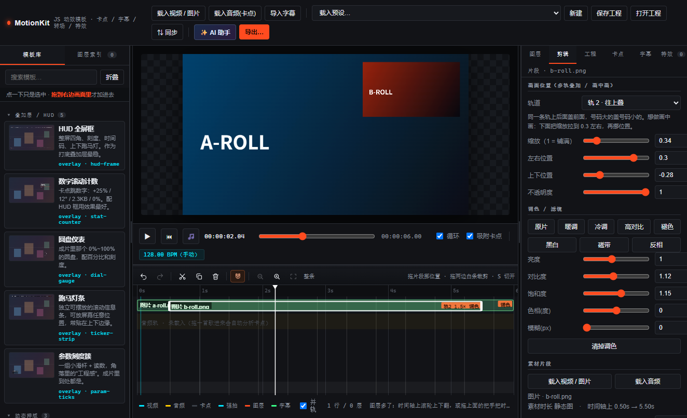

> 上面这张：底轨 A-ROLL 铺满 + 轨 2 的 B-ROLL 缩到 34% 当画中画，两段各自有调色，
> 画中画还开了 1.5× 变速 —— 时间轴上那条片段右边会标出「轨2 1.5× 调色」。

几个说明：

- **变速**是"时间轴 1 秒吃掉素材几秒"。1.5× 的意思是素材 3 秒铺到时间轴上只要 2 秒。
  预览会真的用 `playbackRate` 放，导出时逐帧 seek 到正确位置，所以变速不会让声音和画面对不上。
- **多轨叠加**现在有 4 条视频轨（0~3）。同一条轨上是"后面盖前面"，轨号大的盖轨号小的。
  想做画中画：轨号调到 2，缩放拉到 0.3 左右，再用左右 / 上下位置挪到角上。
- **调色**走的是 canvas 的 `ctx.filter`，所以预览、导出、无头渲染三边完全一致 ——
  不会出现"预览调好了、导出跑偏"这种事。
- **交叉淡化**不用手动算：两段音频在时间轴上叠一点，重叠多少就淡化多少，
  接缝处不会有"啪"的一声。想更长就再叠多一点，也可以手动加淡入/淡出。

**时间轴缩放 / 横向滚动**（素材一多，整条铺满就没法看了）：

| 操作 | 效果 |
| --- | --- |
| 工具栏 🔍+ / 🔍− | 放大 / 缩小（以画面中心为锚点） |
| `Ctrl`（或 `Alt`）+ 滚轮 | 以**鼠标位置**为中心缩放 —— 想看清楚哪一段就冲哪儿滚 |
| `Shift` + 滚轮 | 左右平移 |
| 工具栏 ⤢ | 整条铺满（回到默认） |
| 播放时 | 放大之后播放头跑出可见区，时间轴自己跟着滚 |

放大以后标尺会自动改刻度（20 秒的工程放大到 196%，刻度就从 2 秒一根变成 1 秒一根），
片段的缩略图和波形也跟着放大，裁切能对到帧。

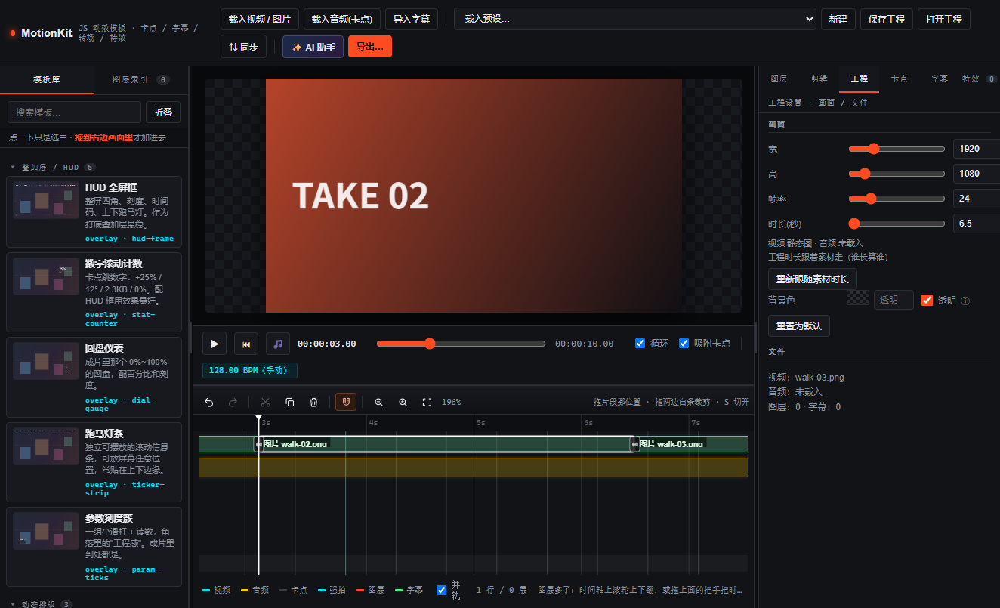

**片段之间加转场**：同一轨上两段贴在一起时，接缝处会出现一个小方块（⋈），点它选效果 ——
也可以右栏「剪辑 → 加转场」。转场骑在切口上，前后各占一半（时长可调 0.2~2 秒）。

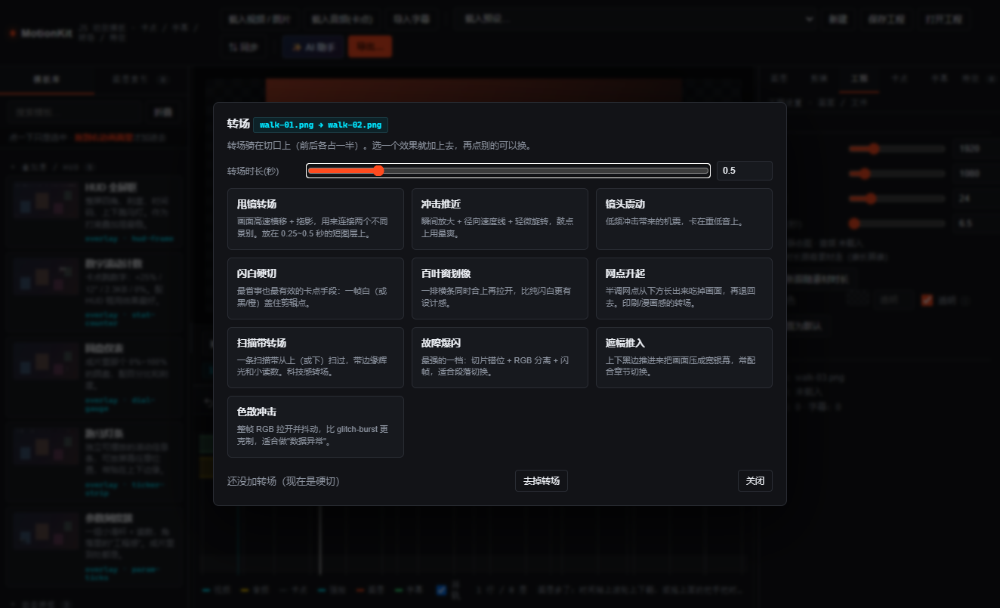

引擎里那 10 个转场模板（甩镜 / 冲击推近 / 镜头震动 / 闪白硬切 / 百叶窗 / 网点升起 /
扫描带 / 故障爆闪 / 遮幅推入 / 色散冲击）都能用。做法的说明：转场模板本来就是"盖在切口上的
一层效果"，所以画面在转场的**中点换段**，转场盖在上面把这一下遮住 —— 这样不用两路合成，
而且转场本身是一个真的图层（时间轴上能看到、参数面板能调、导出走同一套）。
片段挪了 / 裁了 / 删了，转场会跟着走。

时间轴上方有一排图标（照剪辑软件的习惯放的）：

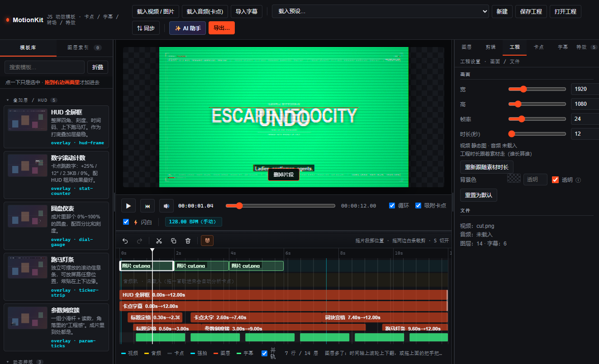

| 图标 | 作用 | 快捷键 |
| --- | --- | --- |
| ↶ ↷ | 撤销 / 重做 | `Ctrl+Z` / `Ctrl+Shift+Z`（或 `Ctrl+Y`） |
| ✂ | 在播放头切开选中的片段 | `S` |
| ⧉ | 复制选中片段接在后面 | `Ctrl+D` |
| 🗑 | 删掉选中的片段（没选片段时删图层） | `Del` |
| 🧲 | 拖动片段时吸附播放头 / 相邻边缘 | 点亮 = 开 |
| 🔍+ / 🔍− / ⤢ | 时间轴放大 / 缩小 / 整条铺满 | `Ctrl`+滚轮 |

**撤销是"改完就能撤"**：每 350ms 比一次工程内容，变了就记一版（最多 60 步）。
拖动 / 框选过程中不记，一次拖拽只留一条；松手后 800ms 内的小改动并进上一条，
所以打字不会一个字留一条历史。在真正的文本框里 `Ctrl+Z` 还是浏览器自己的撤销。

要点：

- **素材和片段是两层**。同一份素材切三刀就是三个片段，各自有入点和长度 —— 剪映也是这么分的。
- **视频、图片、音频都能剪**。图片默认给 3 秒，拖右边随便改长；视频/音频裁剪到头就停住。
- **导出走的就是时间轴上的样子**。预览、无头渲染、导出的 MP4 是同一套引擎，
  按片段找素材、按入点取时间，所以"所见即所得"。
- **MP4 带声音时混的是整条时间轴**：每段音频 / 视频按自己的位置、入点、音量混进去
  （离线渲染，不受播放速度影响）。

还没做的（说清楚免得踩空）：关键帧动画（现在每段的位置/缩放是常量）、蒙版 / 裁剪、
画中画的圆角描边、降噪这类音频处理。转场只有画面轨有。

---

## 模板总览（46 个）

### 叠加层 / HUD

| id | 名称 | 说明 |
| --- | --- | --- |
| `hud-frame` | HUD 全屏框 | 四角括号、侧边刻度、时间码、上下跑马灯、电平条、噪点。做打底最稳 |
| `stat-counter` | 数字滚动计数 | `+25%` / `12°` / `2.3KB`，count / slot / scramble 三种滚动 |
| `dial-gauge` | 圆盘仪表 | 带刻度和百分比的圆盘 |
| `ticker-strip` | 跑马灯条 | 独立可摆放的滚动信息条，右侧带实时帧号 |
| `param-ticks` | 参数刻度簇 | 一组小滑杆 + 读数，角落里的"工程感" |

### 动态排版

| id | 名称 | 说明 |
| --- | --- | --- |
| `kinetic-type` | 卡点大字 | 每个卡点换一句大字，slam / cut / scramble / typewriter / stack 五种切换 |
| `word-grid` | 词块宫格 | `ESCAPE / VELOCITY / PERMANENT / UNDERCLASS` 逐格点亮 |
| `title-mark` | 标题定格 | 带引线和小注解的标题（`ZERO-DAY.` / `STARGATE:`） |
| `subtitle-kinetic` | 卡点字幕 | 读取字幕轨，四种样式 |

### 设计排版〔新增〕

和上面那批"终端 HUD"是两套语言：大留白、细线、克制的动效，适合纪录片 / 访谈 / 品牌片 / 片尾。

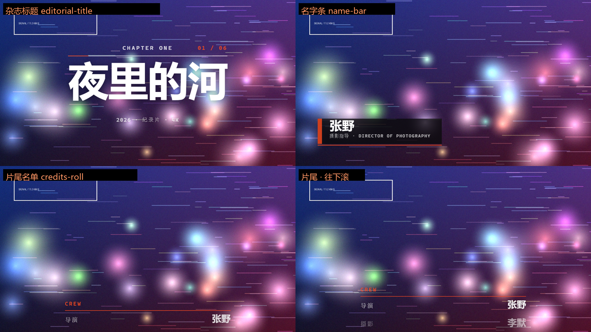

| id | 名称 | 说明 |
| --- | --- | --- |
| `editorial-title` | 杂志标题 | 大标题 + 细分割线 + 小号大写标签 + 编号，编辑部那套排版。可加垫底色压住花哨素材 |
| `name-bar` | 名字条 | 电视台那种左下角名字条：色块滑入 + 姓名 + 头衔。访谈 / 解说 / 集锦 |
| `credits-roll` | 片尾名单 | 从下往上滚的片尾名单，左边职位右边名字，带出画淡出与速度控制 |

预设 `presets/design-demo.json`（载入预设 → 设计排版）能一次看到这三款的效果。

### 聚焦 / 标注〔新增〕

把观众的眼睛按到画面里的某一块 —— 讲细节、做分析、标设备的时候特别有用。

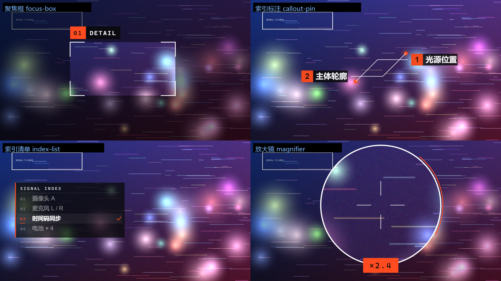

| id | 名称 | 说明 |
| --- | --- | --- |
| `focus-box` | 聚焦框 | 四角括号飞进来 + **框外压暗**，框里那块自然就亮了；区域可拖可改，带编号标签与呼吸脉冲 |
| `callout-pin` | 索引标注 | 编号圆点 + 折线引线 + 标签，指住画面上任意一点；**多放几层就是 ①②③** |
| `index-list` | 索引清单 | 一块编号清单，逐条打勾往上推进（可跟拍点），适合分镜、设备清单、要点罗列 |
| `magnifier` | 放大镜 | 圆形镜片把画面某处**真的放大**（镜片里是画面本身），带准星与倍率角标 |

预设 `presets/focus-demo.json`（载入预设 → 聚焦标注）一次看完四款。

### 秩序 / 混沌〔新增〕

按一张参考海报（5 屏序列：网格一步步崩坏）做的一整套。纸白底、墨黑线、一记橙红，
Swiss 海报那套语言。

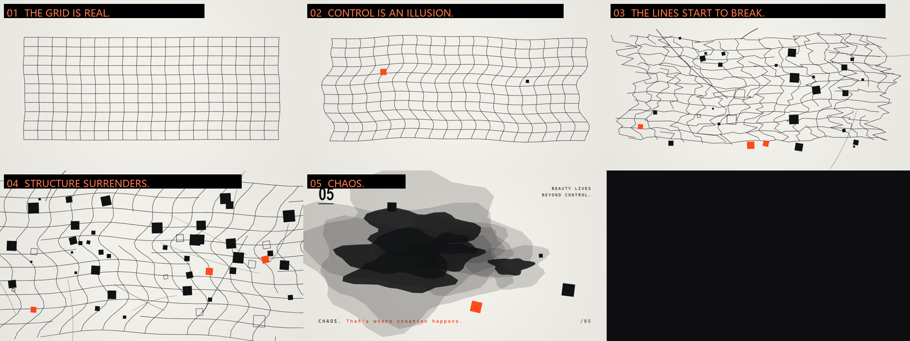

| id | 名称 | 说明 |
| --- | --- | --- |
| `grid-field` | 网格场 | 规整网格 → 扭曲 → 断裂 → 爆散，**一个 `chaos` 参数驱动全过程**，也能勾「自动崩坏」让它自己演进；散落的方块随 chaos 变多，混一两个橙的 |
| `series-index` | 系列编号 | 左上大编号 + 右上小注脚 + 左下 `ORDER → CHAOS` + 右下页码 + 中间大字标题（末尾橙点会弹一下）；带纸白底和细边框 |
| `ink-scatter` | 墨迹与碎块 | 墨团（多层灰晕 + 墨芯）+ 细线 + 散落方块，一块块弹出来；可以单独叠在实拍上当"混沌质感" |

预设 `presets/chaos-demo.json`（载入预设 → **秩序 / 混沌**）就是那 5 屏序列，
20 秒，每屏 4 秒：`01 THE GRID IS REAL.` → `02 CONTROL IS AN ILLUSION.` →
`03 THE LINES START TO BREAK.` → `04 STRUCTURE SURRENDERS.` → `05 CHAOS.`

**延伸四款**（同一套语言往下做）：

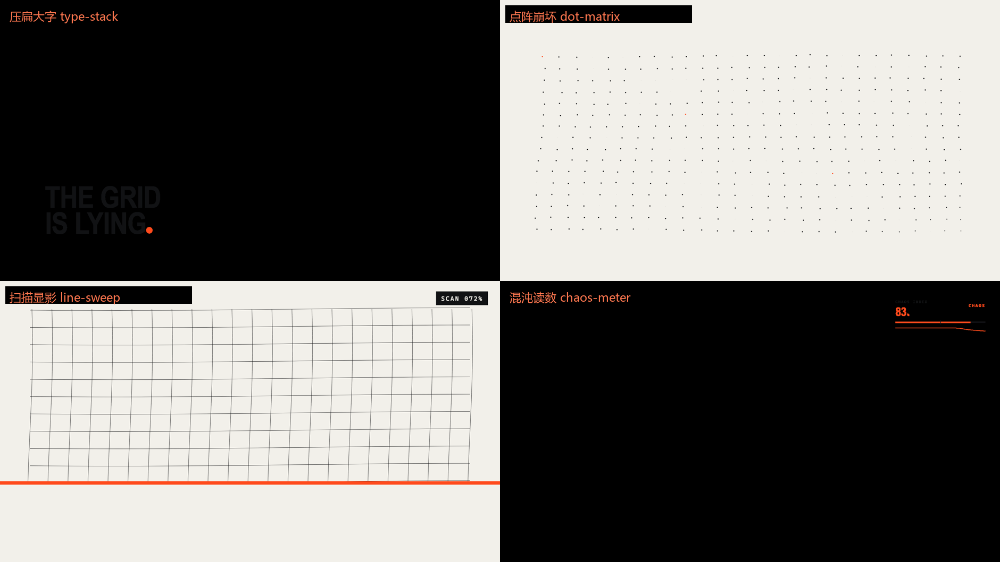

| id | 名称 | 说明 |
| --- | --- | --- |
| `type-stack` | 压扁大字 | 图里那种压扁大写标题：行距很紧、末尾跟橙点、可高亮某个词；也能**竖排**（中文标题好用），也能单行 |
| `dot-matrix` | 点阵崩坏 | 规则圆点阵的同类崩坏：chaos 越大点越位移/消失/散开，混几个橙点当重音 |
| `line-sweep` | 扫描显影 | 一条扫描线扫过，**扫到哪儿哪儿才显影**（网格或点阵），角上带 `SCAN 072%` 读数，可循环 |
| `chaos-meter` | 混沌读数 | 角上的监测仪：大数字 + 横条 + 阈值刻度 + `ORDER / CHAOS` 状态词（过线变橙并闪）+ 迷你趋势线 |

### 数据 / 图表

讲解、汇报、趋势对比用。两款都做"从零长出来"的入场，数据直接写参数里。

| id | 名称 | 说明 |
| --- | --- | --- |
| `bar-chart` | 柱状图 | 每行写「名字\|数值」，柱子错峰长出来，最高的一根自动高亮，带数值和网格 |
| `line-chart` | 折线图 | 数据逗号或换行都行，折线从左往右画出来，末端跟一个数值角标，可填面积 |

### 分屏与章节〔新增〕

| id | 名称 | 说明 |
| --- | --- | --- |
| `split-compare` | 分屏对比 | 中间一条分隔线 + 把手，两侧挂标签（原片 / 成片），可以**自动扫过去**做前后对比 |
| `chapter-bar` | 章节进度 | 底部细进度条 + 章节刻度 + 当前章节名 + 时间码，长视频一眼看出"现在到哪了" |

### 手绘与定位〔新增〕

| id | 名称 | 说明 |
| --- | --- | --- |
| `hand-mark` | 手绘圈注 | 手绘感的**圈选 / 下划线 / 箭头**，笔迹会自己画出来，线条带手抖（每层都不一样） |
| `locator` | 地图定位 | 定位框 + 地名 + 坐标 + 比例尺 + 指北针，压在地图上用 |

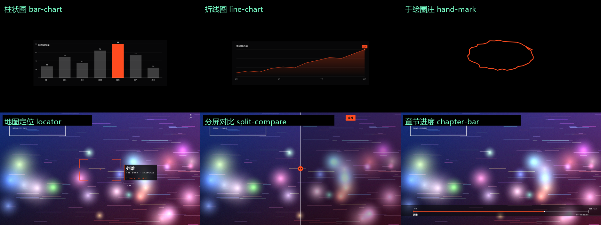

预设 `presets/data-demo.json`（载入预设 → 数据标注）一次看完这六款。

### 摇滚 / 海报

印刷海报那一路：压扁的大字、故意做旧的错版重影、网点、胶带、撕边，
动效是"砸下来 + 抖一下"，不是慢慢淡入。

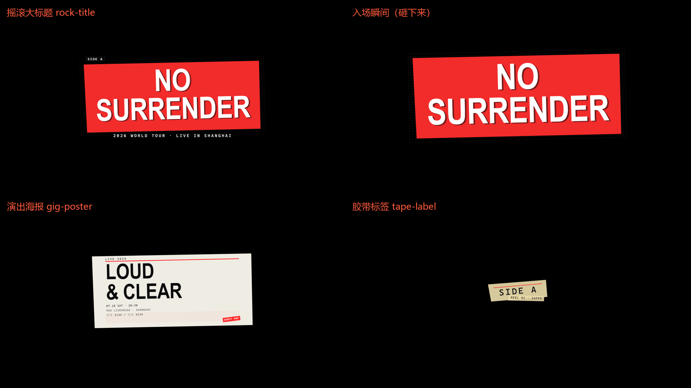

| id | 名称 | 说明 |
| --- | --- | --- |
| `rock-title` | 摇滚大标题 | 撕边色带 + 压扁大字 + 错版重影 + 落地抖动，左上角还能挂个 `SIDE A` 标签 |
| `gig-poster` | 演出海报 | 海报式信息卡：大标题 + 日期 / 场地 / 票价 + `ADMIT ONE` 角标，网点做旧 |
| `tape-label` | 胶带标签 | 一截胶带啪地贴上去，带撕边和纤维纹路，可以再叠一小截写备注 |

## 自动卡点剪辑（跟着音乐剪）

`tools/autocut.py`：给一首歌 + 一堆素材，自动按拍点剪成一条片子。

```bash
# 先看它打算怎么剪（不落盘）
python tools/autocut.py --music song.mp3 --clips D:\clips --dry-run

# 真剪：按拍点切素材 → 拼接 → 配上这首歌
python tools/autocut.py --music song.mp3 --clips D:\clips --out projects/rock-auto

# 只生成摇滚叠加层工程（不剪片），在工作室里接着调
python tools/autocut.py --music song.mp3 --clips D:\clips --scene-only --title "NIGHT DRIVE"
```

它怎么决定"哪里切"：分频段谱通量求拍点（和工作室里同一套算法）→ 归一到 4 拍强拍网格 →
按每段能量档位给密度（**安静段 4 拍一刀 / 中段 2 拍 / 爆点 1 拍**）→
切点再做 ±90ms 的起音峰吸附。实测切点与拍点的最大偏差 **8ms**。

顺便会自动生成一份**摇滚风格的 2 分钟叠加层工程**（开场大标题、每个段落一枚胶带标签、
副歌砸大字、收尾、配好 BPM 与卡点）：`presets/rock-2min.json` 就是用它生成的示例，
在工作室里「载入预设 → 摇滚 2 分钟」可以直接打开接着调。

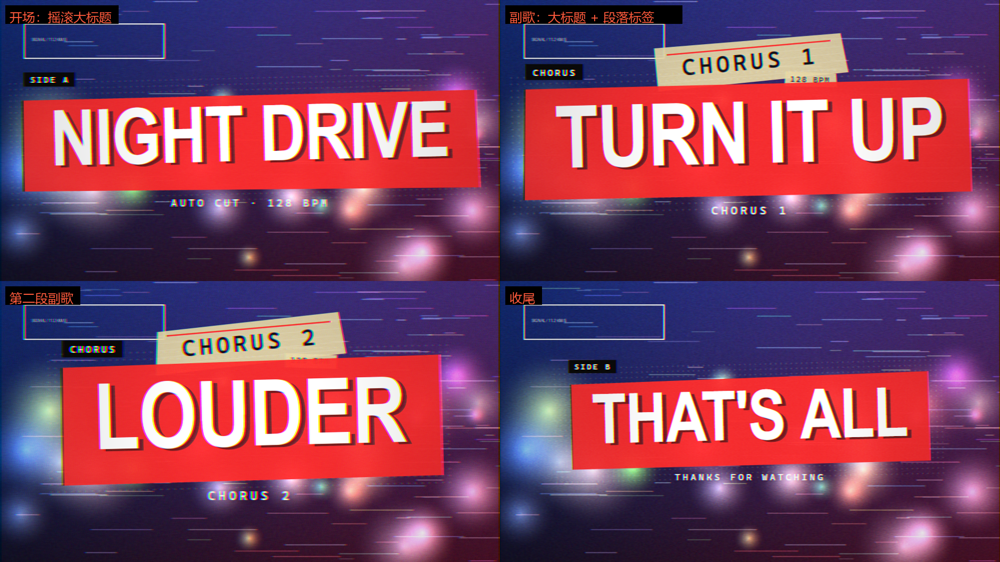

### 面板卡片

| id | 名称 | 说明 |
| --- | --- | --- |
| `terminal-prompt` | 终端面板 | 黑底等宽窗口 + 打字机 + 光标 |
| `look-card` | 编号卡片 | `Look 06` 那种白卡，一条条按节拍弹出来 |
| `shipping-label` | 吊牌 / 条码卡 | `Do not iron / Wash cold / Made in San Francisco` 吊牌 |
| `note-bubble` | 注释气泡 | 黑底小气泡 + 一行代码 |

### 转场 / 冲击

| id | 名称 | 实现方式 |
| --- | --- | --- |
| `whip-pan` | 甩镜转场 | 变换式：位移 + 拖影 + 速度线 |
| `zoom-punch` | 冲击推近 | 变换式：放大 + 径向速度线 + 旋转 |
| `cam-shake` | 镜头震动 | 变换式：机震，压重低音 |
| `flash-cut` | 闪白硬切 | 遮罩式 |
| `shutter-wipe` | 百叶窗划像 | 遮罩式 |
| `halftone-rise` | 网点升起 | 遮罩式 |
| `scan-wipe` | 扫描带转场 | 遮罩式 |
| `glitch-burst` | 故障爆闪 | 遮罩式：切片 + RGB 分离 + 闪帧 + 色块 |
| `letterbox-push` | 遮幅推入 | 遮罩式 |
| `rgb-split` | 色散冲击 | 遮罩式 |

> **变换式**会先快照整帧再重绘，所以它们**必须放在图层栈最上面**。
> 从模板库点加的图层默认追加在末尾，正好符合这个规则。

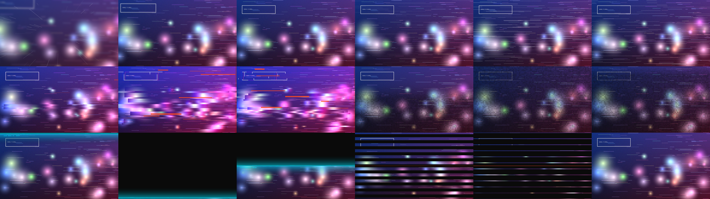

### 后期特效（是特效栈，不是图层）

写在工程的 `fx` 数组里，按顺序全屏叠加：

`grain` 颗粒 · `scanlines` 扫描线 · `chromatic` 色差 · `glitch` 故障切片 ·
`flash` 闪白（支持 `hits: "beats"` 自动踩点）· `vignette` 暗角 · `bloom` 辉光 ·
`halftone` 半调 · `pixelate` 像素化 · `vhs` · `datamosh` 数据摩什 ·
`letterbox` 遮幅 · `bleach` 漂白 · `invert` 反相

```json
"fx": [
  { "type": "grain", "amount": 0.12 },
  { "type": "scanlines", "amount": 0.14, "step": 3 },
  { "type": "chromatic", "amount": 3, "animated": true, "jitter": 1.5 },
  { "type": "vignette", "amount": 0.5 },
  { "type": "flash", "hits": "beats", "duration": 0.06, "amount": 0.18 }
]
```

`hits` 可以写 `"beats"`（每个拍）、`"downbeats"`（每小节第一拍）、`"bars"`，也可以直接给一串秒数。

---

## 导出 & 接进剪辑软件

点右上角 `导出…`：

| 导出项 | 用途 |
| --- | --- |
| **PNG 序列（ZIP，含透明）** | 最通用。解压后一批 PNG 直接拖进任何剪辑软件 |
| **WebM（VP9 含透明）** | 一个文件搞定，Premiere 2020+ / 剪映可直接读 |
| **MP4（H.264 · 直接出片）** | 点一下直接下载一个能播的 `.mp4`，不用装 ffmpeg 也不用转码 |
| **ProRes 4444（.mov 含 Alpha）** | 画质最好，走本机 ffmpeg（见下） |
| **工程 JSON** | 保存 / 分享你的模板组合和全部参数 |
| **卡点标记** | txt 标记，导入 Premiere 后时间轴上是一条条卡点 |
| **字幕 SRT** | 导出当前字幕轨 |

弹窗下面有个开关：**"把底下的视频/图片一起渲染进去"**。
默认不勾选 = 只导出带透明的叠加层（剪辑时铺在上面）；勾上了就是直接把效果烧进画面。

### 直接出 MP4

**导出… → MP4（H.264）** 就完事：结束后直接下载 `motionkit_时间戳.mp4`。走的是 WebCodecs
（`VideoEncoder` / `AudioEncoder`）+ 自己的 MP4 封装器（[engine/mp4.js](engine/mp4.js)），
逐帧编码，合成结果和无头渲染是同一个引擎，不会"预览一个样、导出另一个样"。

两件要知道的事：

- **帧精确，导出多长就是工程多长**。这一点以前是错的：浏览器录屏（MediaRecorder）按
  **墙上时钟**给帧打时间戳，渲染一帧比 `1/fps` 慢的时候，2 分 40 秒的工程能导出成 6 分钟。
  现在每帧的时间戳是 `i/fps` 写在文件里的，而且不用等实时 —— **渲染多快就多快**。
- **可以带声音**。弹窗里那个「导出 MP4 时带上声音」默认开着：会把「载入音频」那一轨
  重新解码、编成 AAC（192k）封进同一个文件里，从 0 秒开始、长度跟着工程走。
  没载入音频、或者浏览器没有 `AudioEncoder` 时，自动出无声的 MP4，不报错。
  PNG 序列 / WebM / ProRes 那几项仍然只有画面。
- **没有透明通道**（H.264 就不支持），所以透明区域由程序**压成深色底**再编码 ——
  不然交给浏览器自己合，实测会变成浅灰，白字压上去直接看不清。
  想把实拍一起烧进去就勾上那个"把底下的视频/图片一起渲染进去"。

> 要"你自己剪好的片子 + 原声 + 叠加层"还是走另一条：
> `tools/encode.py --overlay 原片.mp4 --audio 音乐.wav`，或者 AI 助手跑 `--render`。

Firefox / Safari 目前没有 MP4 录制能力，这种情况下会直接告诉你改用 PNG 序列，
而不是给你一个后缀是 `.mp4`、其实打不开的文件。

> WebM（VP9 含透明）那条路还是**实时录制、无声**，渲染慢就把时长拖长 ——
> 要准的、要带声音的用 MP4，要透明的用 PNG 序列 / ProRes。

### 用 ffmpeg 编码 / 直接烧到成片

```bash
# PNG 序列 -> ProRes 4444（带 Alpha，PR / FCP / 达芬奇都认）
python tools/encode.py --in .out/frames --out ESCAPE.mov --codec prores4444 --fps 24

# PNG 序列 -> WebM VP9（带 Alpha，体积小）
python tools/encode.py --in .out/frames --out ESCAPE.webm --codec webm-alpha --fps 24

# 直接把叠加层烧到你的剪辑上，并配上音频
python tools/encode.py --in .out/frames --out final.mp4 --codec h264 \
    --overlay my_cut.mp4 --audio music.wav --fps 24
```

> ffmpeg 从哪来：优先用 `pip install imageio-ffmpeg` 自带的那份，其次找系统 PATH。
> 本机已经装了 `imageio-ffmpeg`，直接能用。

具体软件的导入步骤见 [docs/](docs/)：Premiere、剪映专业版、达芬奇、AE 各有一份。

---

## 命令行：无头批量渲染

不用打开界面，直接用本机 Chrome/Edge 逐帧渲染（零 npm 依赖，靠 Node 内置 WebSocket 走 CDP）。

```bash
# 渲染一个工程
node tools/render.mjs --scene presets/slopcore.json --out .out/slop --fps 24

# 只渲染一个模板来试参数
node tools/render.mjs --template hud-frame --duration 3 --width 1920 --height 1080 --out .out/hud

# 只看 [1.0, 2.5] 秒这一段
node tools/render.mjs --scene presets/slopcore.json --out .out/cut --range 1.0 2.5

# 把一张底图垫在下面，用来核对叠加层 / 转场
node tools/render.mjs --scene presets/transitions-demo.json --media docs/sample-footage.jpg --out .out/trans

# 直接跑打包好的单文件版，连服务器都不用起
node tools/render.mjs --page dist/studio.html --scene presets/demo-scene.json --out .out/frames
```

| 参数 | 说明 |
| --- | --- |
| `--scene <file>` | 工程 JSON |
| `--template <id>` | 快速模式：单个模板铺满整段 |
| `--page <file>` | 用打包好的 `dist/studio.html` 渲染 |
| `--media <image>` | 垫一张底图 |
| `--width/--height/--fps/--duration` | 覆盖工程里的设置 |
| `--range <a> <b>` | 只渲染这段时间（秒） |
| `--bg <#hex>` | 给个不透明底色；不给就是透明 |
| `--out <dir>` | 输出目录 |
| `--browser <path>` | 手动指定浏览器 |

完整流程（`npm run demo` 就是跑这个）：

```bash
node tools/render.mjs --scene presets/demo-scene.json --out .out/demo --fps 24
python tools/encode.py --in .out/demo --out .out/demo.mov --codec prores4444 --fps 24
```

---

## 写自己的模板

一个模板就是一个对象，看三个字段：`params`（自动生成右侧控件）、`draw`（画一帧）。

```js
// templates/my-effect.js
import { text, hudPanel, ui } from '../engine/draw.js';
import { envelope, color, P } from './_lib.js';

export const myEffect = {
  id: 'my-effect',
  name: '我的效果',
  category: 'overlay',              // overlay | typography | caption | panel | transition
  hint: '一句话说明，会显示在模板库和搜索里',
  params: [
    { key: 'title', label: '标题', type: 'string', default: 'HELLO' },
    { key: 'position', label: '位置', type: 'string', default: '0.5,0.5' },
    P.color('white'),
    P.accent('orange'),
  ],
  draw(ctx, env) {
    // env 里有：scene / t / local / duration / progress / params
    //          / rng（确定性随机）/ beat / beatPhase / beatIndex / caption / frame / fps
    const { width: w, height: h, params: p } = env;
    const a = envelope(env.progress, { inFrac: 0.1, outFrac: 0.1 });  // 自动进退场
    if (a <= 0.001) return;
    const [nx, ny] = String(p.position).split(',').map(Number);
    ctx.save();
    ctx.globalAlpha *= a;
    hudPanel(ctx, w * nx - 160, h * ny - 40, 320, 80);
    text(ctx, p.title, w * nx, h * ny, {
      font: 'Arial Narrow, sans-serif', size: 40, weight: 700,
      color: color(p.color, ui.paper), align: 'center', baseline: 'middle',
    });
    ctx.restore();
  },
};

export default [myEffect];
```

然后在 `templates/index.js` 里 import 进来、加进 `ALL`，跑一次 `npm run bundle` 就完事。

**几个约定**（照着做风格才会统一）：

- 图层默认画在**透明画布**上，别自己填满屏幕
- 用 `envelope()` / `envelopeByTime()` 做进退场，别硬切
- 随机一律走 `env.rng` 或 `trng(env)`，保证预览和导出逐帧一致
- 想要"跟着拍走"就用 `env.beatPhase`（距最近拍的时间差）和 `env.beatIndex`

### 可用的绘图原语

`engine/draw.js` 里都是成套的：`text` `label` `measure` `fitSize` `wrap` `scramble` `typewriter` `blink`
`roundRect` `cornerTicks` `hudPanel` `microRow` `statBlock` `hbar` `ticker` `barcode` `dial` `crosshair`
`dotGrid` `gridLines` `scanlines` `card` `ruler` `sprockets` `quoteBubble` `shake` `box` `pt` `palette` `FONTS`。

---

## 目录结构

```
动效JS插件/
├─ dist/studio.html        ← 打包好的单文件版，双击就用
├─ studio/                 工作室界面（index.html / studio.css / studio.js）
├─ engine/
│   ├─ core.js             时间轴 / 节拍图 / 图层 / 素材片段(Clip) / 场景 / 缓动 / 确定性随机 / 渲染调度
│   ├─ draw.js             绘图原语（HUD 框、等宽标签、跑马灯、条码、仪表、网点……）
│   ├─ fx.js               后期特效栈 + runFx + beatHits
│   ├─ audio.js            卡点分析（STFT 分频段通量 → 自相关 → 最小二乘精修）
│   ├─ srt.js              字幕解析 / 导出 / 切短句 / 词级时间估算
│   ├─ zip.js              ZIP 写入器（含流式版本，边渲染边落盘）
│   └─ mp4.js              MP4 封装器（H.264 视频轨 + 可选 AAC 音轨，帧精确；导出 MP4 用）
├─ templates/              46 个模板（hud / type / design / chaos / data / focus / mark / rock / panels / transitions / hits）
├─ presets/                slopcore / slopcore-3min / demo-scene / design-demo / rock-2min / focus-demo / data-demo / chaos-demo + index.json
├─ agent/                  AI 助手：分析 → 转写 → 文案 → 排布 → 成片
│   ├─ autopilot.py        总入口（CLI 也是本地服务调的那支）
│   ├─ analyze.py          拍点 / 镜头切点 / 亮度 / 运动量 / 人声段
│   ├─ transcribe.py       语音转写（本地 faster-whisper 或任意 OpenAI 兼容接口）
│   ├─ llm.py              文案与定调（DeepSeek / OpenAI / 本地 Ollama 都行）
│   ├─ director.py         导演：把分析 + 选择 + 文案排成图层栈（含占位避让）
│   ├─ styles.json         6 套配色风格预设
│   ├─ schema.json         从 46 个模板导出的参数表，用来校验生成结果
│   └─ _mock_api.py        离线自检用的假接口
├─ tools/
│   ├─ serve.mjs           零依赖静态服务器
│   ├─ render.mjs          无头批量渲染（CDP + Node 内置 WebSocket）
│   ├─ shot.mjs            工作室界面截图 / 拿脚本驱动界面（改完 UI 自己看一眼）
│   ├─ ui-selftest.js      预览直接操控的自检脚本（点选/拖动/缩放/旋转/改字）
│   ├─ ui-persist-test.js  「刷新后工程还在吗」的自检（改工程 → 刷新 → 核对）
│   ├─ ui-caption-test.js  「字幕换装」的自检（轮换会不会重复、换一批有没有换、整组改）
│   ├─ ui-marquee-test.js  「框选 + 批量删除」的自检（拉框选几层、Shift 加选、Del 一次删光）
│   ├─ ui-export-test.js   「直接导出 MP4」的自检（解出文件头是不是 ftyp、能不能播、有没有画面）
│   ├─ ui-clip-test.js     「素材剪辑」的自检（挪/裁/切/删 + 导出的红蓝两段颜色对得上）
│   ├─ ui-history-test.js  「时间轴工具栏 + 撤销/重做」的自检（Ctrl+Z 真能回到改之前）
│   ├─ ui-zoom-test.js     「缩放/横向滚动 + 转场」的自检（缩放改映射、转场那一帧真的变亮）
│   ├─ ui-adv-test.js      「变速/多轨/调色/交叉淡化」的自检（取色验证画中画与滤镜真的生效）
│   ├─ bundle.mjs          单文件打包
│   ├─ schema.mjs          导出模板参数表给 agent 用
│   ├─ make-long-preset.py 按秒数生成 slopcore 长预设（180 秒 / 300 秒随便改）
│   ├─ caption-styles-demo.py 把一份预设的字幕按「字幕换装」重铺，生成演示工程
│   ├─ sheet.py            抽帧拼对照图（带时间码标签），做预览图用
│   ├─ encode.py           PNG 序列 → ProRes / WebM / H.264，以及烧到成片
│   ├─ autocut.py          跟着音乐自动剪片（卡点剪辑 + 自动生成摇滚叠加层工程）
│   └─ beatmap.py          命令行卡点分析
└─ docs/                   效果对照表 + 各软件接入步骤 + 命令速查
```

---

## 已知限制 & FAQ

**刷新一下工程就没了？**

不会了。工作室会自动把工程存在浏览器本地：工程本身（图层 / 参数 / 变换 / 特效栈 /
字幕 / 卡点 / 分辨率帧率）存 localStorage，素材（视频 / 图片 / 音乐）存 IndexedDB。
改完什么都不用点——刷新、关掉浏览器、换一天再打开，都会自动接着上一次，
画面顶上会有一条「已恢复上次的工程」提示：**知道了** 收起来，**丢弃** 从空白重来。

两个边界要说清楚：

1. 单个素材超过 **120 MB** 就不一起存了（会提示你重新拖进来），工程本身照存不误。
   长视频想省事就自己留着原文件，工程在图层的都在。
2. 存的是**这台机器这个浏览器**里的本地数据。清浏览器数据 / 换机器 / 换浏览器 / 发给别人，
   都要用顶栏的 **保存工程** 存成 JSON 文件（打开工程 载回来）。
   另外用 `?render=1` 或无头渲染打开时不会读写这份存档，不影响批处理。

**双击打不开 / 白屏怎么办？**

**界面字太小 / 图标看不清？**

右栏「工程」页最上面选「界面大小」（小 / 标准 / 大 / 特大），整体一起放大，
包括时间轴上那些画在 canvas 上的字（它们不吃 CSS，是单独一套缩放）。
还可以顺手把左右两栏拖宽（分隔条），参数名会跟着换行更好认。

按这个顺序排查：

1. 用 `启动工作室.bat` 打开（它会挑 Chrome/Edge）
2. 还是白屏 → 说明浏览器不对。右键 `dist/studio.html` → 打开方式 → **Google Chrome**
3. 页面现在有兜底：真出错了会直接显示红色错误面板和错误信息，把那段话发我
4. 用的是源码版（`studio/index.html`）？那个**必须**先 `npm run studio` 起服务器，
   直接双击会因为浏览器不允许 `file://` 加载 ES Module 而白屏

**某个图层位置不对，或者想让它大一点 / 小一点？**

在预览里点一下它，选择框和手柄就出来了：拖动挪位置、拉四个角缩放、转上面那个圆手柄旋转、
双击直接改文字。挪到画面正中会自己吸住，并出现青色对中线。要够到被压住的层，按住 `Alt` 再点。
右侧「图层参数」里的 **复位变换** 能一键还原——它只清掉你手动摆的位移 / 缩放 / 旋转，
模板自己的 `位置` 参数不受影响。

这些变换是写进工程里的（存 JSON、导出、无头渲染都带着），所以摆完直接导出就行。
唯一的例外是**转场类图层**（`whip-pan`、`zoom-punch`、`flash-cut` 这些）：它们每一帧都是把
整个画面抓下来重组，本身就是"整帧效果"，拖动和缩放对它们没有意义。

**AI 助手点了没反应，或者提示「需要开发模式」？**

AI 助手要调 python、ffmpeg 和无头浏览器，只有带后端的开发模式才有。
双击 `dist/studio.html` 是纯前端单文件版，没有后端。改用一键启动：

**双击 `启动工作室.bat`**（或者 `npm run studio` → 打开 http://localhost:5178/studio/index.html），
然后顶栏点 **✨ AI 助手**。

面板顶上那行会告诉你环境缺什么（Python / ffmpeg / LLM / 字幕），缺了也不影响其它部分。
完全不用 LLM 也能跑，只是文案由本地规则生成。

**自动字幕要额外的 Key 吗？**

不用。这台机器已经装好 [faster-whisper](https://github.com/SYSTRAN/faster-whisper)
和 `small` 模型（463 MB，在 `C:\Users\<你>\.cache\huggingface\hub` 里），
**完全离线、免费**。实测 20 秒中文人声约 10 秒出结果。
唯一的取舍是模型大小：想更准就换 `medium`（越准越慢），详见
[agent/README.md](agent/README.md#本地字幕这台机器上已经装好)。

**AI 助手生成的不合口味？**

先调那两个滑杆：**幅度**管"狠不狠"，**密度**管"东西多不多"——这两个能解决八成的口味问题。
换 **配色风格** 是第二大杠杆。还想更细就让它在工作室里当草稿：工程载进来之后，
每个图层、每个参数都能继续改，跟手搓的工程没有任何区别。
它每次的判断和理由都写在输出目录的 `report.md` 里，先看那份比瞎调快。

**它会不会写出引擎不认的工程？**

不会。生成之后会拿 `agent/schema.json`（从 46 个模板导出的参数表）逐字段校验：
不认识的键丢掉、越界数字钳回范围、非法选项退回默认，越界的情况会记在 `report.md` 里。

**为什么导出的 PNG 这么大？**
颗粒（grain）是逐像素噪声，PNG 压不动。1 秒 1080p 大概 200–400 MB。
如果嫌大：把 `fx` 里的 `grain` 去掉，或者先导 ProRes 4444（有压缩且无损）。

**能出 4K 吗？**
能。工程设置里把宽高改成 3840×2160 就行。渲染速度约 2–4 帧/秒（看模板数量）。

**导出的时候要等很久？**
PNG 序列是逐帧起浏览器渲染的，1080p 大概 8–15 帧/秒。
导出时先弹一个保存框（Chrome 的 File System Access），选好路径后是**边渲染边写盘**，
不会把几百帧堆在内存里。

**转场模板为什么看不出效果？**
变换式转场（甩镜 / 推近 / 震动）需要底下有画面。如果没载入素材，它们会去快照一张空画布。
载入视频、或者用 `--media` 垫张图就能看到。

**卡点不准？**
先看时间轴上的卡点线跟波形对不对得上。差一点点的话，在右边"卡点"里微调 `偏移`（秒）。
差半拍的话把 `BPM` 乘 2 或除 2。乐器密集的曲子可以试着把 `--bpm-min/--bpm-max` 收窄。

**能用在 Premiere 里当面板吗？**
现在的形态是"工作室 + 通用文件导出"，所有剪辑软件都能用。
面板化（CEP/UXP）需要额外打包和签名，如果你确定要我可以再加一层壳。
