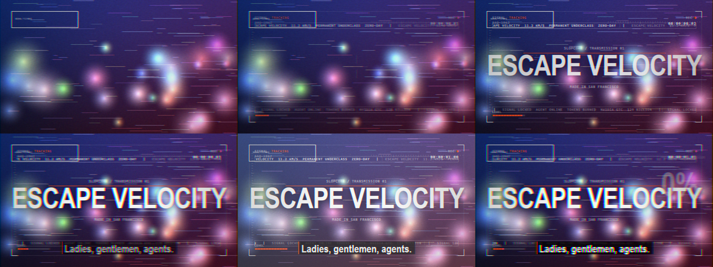

# 效果对照表：视频里的画面 → 用哪个模板

对照的是 [SLOPCORE: ESCAPE VELOCITY](https://www.youtube.com/watch?v=C3fxudvU-UU)。
左边是你在片子里看到的东西，右边是 MotionKit 里对应的做法。



## 1. 一直铺在最底下的那层"UI 底噪"

| 画面里看到的 | 怎么做 |
| --- | --- |
| 四角的白色细线括号、边缘的刻度尺 | `hud-frame`，`corners: true` + `rulers: true` |
| 左上角 `SIGNAL / TRACKING / 3-4 位乱码` | `hud-frame` 的 `labelLeft`，乱码是自动生成的 |
| 右上角红点 + `02:08:09` 时间码 | `hud-frame` 的 `labelRight` + `timecode`，红点跟着拍闪 |
| 上下两条滚动的数字 / 大写字母带 | `hud-frame` 的 `tickerTop` / `tickerBottom`，或者单独放 `ticker-strip` |
| 左下角那几个小滑杆和读数 | `param-ticks` |
| 画面中心极淡的十字准星 | `hud-frame` 里的 crosshair（`noise` 调大一点更明显） |
| 整屏的颗粒和轻微色散 | `fx` 里加 `grain` + `chromatic` |

```json
{ "template": "hud-frame", "start": 0, "end": 12,
  "params": { "inset": 46, "noise": 0.6, "labelLeft": "SIGNAL", "labelRight": "REC" } }
```

## 2. 卡点大字

| 画面里看到的 | 怎么做 |
| --- | --- |
| `LOCK` / `LOCK IN` 一帧一个词 | `kinetic-type`，`mode: "cut"`，`beatsPerStep: 2` |
| `ESCAPE VELOCITY` 猛地砸进来（带残影） | `kinetic-type`，`mode: "slam"`，`ghost: true` |
| `PERMANENT UNDERCLASS` 一行满了自动缩小 | `kinetic-type`，`fit: true`，`maxWidth: 0.88` |
| 文字从乱码解码出来 | `kinetic-type`，`mode: "scramble"` |
| `IT'S SO OVER` 这种黑白反转的大字 | `kinetic-type`，`plate: "#000000"`，`color: "white"` |
| `ESCAPE \)VELOCITY \(PERMANENT \)UNDERCLASS` 的方格墙，一格一格亮 | `word-grid`，`mode: "sequence"`，`fillActive: true` |
| `ZERO-DAY.` / `STARGATE:` 带引线和小注解 | `title-mark` |
| `12°` / `+25%` / `11.2` 大数字往上涨 | `stat-counter`，`roll: "count"` |
| `0%` ~ `100%` 的圆盘 | `dial-gauge` |

## 3. 卡片和面板

| 画面里看到的 | 怎么做 |
| --- | --- |
| 白底小卡 `Look 06: Our Waymo hit someone.` 一条条弹 | `look-card`，`stagger: 2` |
| 黑底终端窗口，`PROMPT:` 后面一行行打字 | `terminal-prompt`，`charDelay: 0.02` |
| `command+shift+k 出戏` 那个黑气泡 | `note-bubble` |
| `SHELL!` / `Do not iron / Wash cold / Made in San Francisco` 吊牌 + 条码 | `shipping-label` |
| `2.3 KB` `± 0.01` 这种小读数成堆出现 | `param-ticks` + `hud-frame` |

## 4. 转场

| 画面里看到的 | 怎么做 |
| --- | --- |
| 硬切时"啪"一下闪白 | `flash-cut`（0.2 秒图层）或 `fx: flash` 配 `hits: "beats"` |
| 画面被横向扯走、带拖影和速度线 | `whip-pan` |
| 鼓点上猛地推近、四周有放射线 | `zoom-punch` |
| 低音一来整个画面在抖 | `cam-shake` |
| 横向百叶窗合上再打开 | `shutter-wipe` |
| 网点从下往上吃掉画面 | `halftone-rise` |
| 一条发光的扫描带扫过 | `scan-wipe` |
| 切片错位 + RGB 分离 + 闪帧 | `glitch-burst` |
| 上下黑边推进来压成宽银幕 | `letterbox-push` |
| 整帧 RGB 拉开（偏克制） | `rgb-split` |

## 5. 后期质感

视频里那种"数码脏感"基本是这几个叠出来的，推荐顺序：

```json
"fx": [
  { "type": "grain", "amount": 0.12 },
  { "type": "scanlines", "amount": 0.14, "step": 3 },
  { "type": "chromatic", "amount": 3, "animated": true, "jitter": 1.5 },
  { "type": "vignette", "amount": 0.5 },
  { "type": "flash", "hits": "beats", "duration": 0.06, "amount": 0.18 }
]
```

想要更脏：加 `vhs` 或 `datamosh`；
想要漫画印刷感：`halftone`；
想要"数据崩坏"：`glitch` 的 `amount` 给到 1.5 以上。

## 6. 现成的整包

不想一个个搭的话，直接载入预设：

- `presets/slopcore.json` —— 12 秒全套（HUD + 大字 + 词块 + 卡片 + 吊牌 + 字幕 + 5 层特效）
- `presets/slopcore-3min.json` —— 3 分钟版（180 秒 / 40 图层 / 6 段，转场 + 卡点大字 + 信息层，卡点闪白走特效栈）
- `presets/slopcore-captionstyles.json` —— 字幕换装演示（同一份 12 秒工程，六句台词六个样子）
- `presets/demo-scene.json` —— 6 秒精简版
- `presets/transitions-demo.json` —— 6 个转场挨着放一遍，用来挑转场

在右上角 `载入预设…` 里选，或者命令行：

```bash
node tools/render.mjs --scene presets/slopcore.json --out .out/slop --fps 24
```
